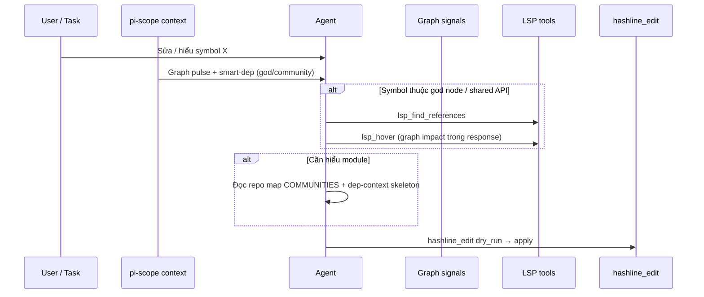

# Kế hoạch khai thác Code-Graph Analysis — sử dụng đúng cách & mở rộng tiềm năng

> **Phiên bản:** 1.0 · **Ngày:** 2026-05-30 · **Trạng thái:** ✅ v1 triển khai (690 tests)  
> **Baseline code:** `master` @ 690 tests (hashline v2 + LSP v1 + graph adoption v1)  
> **Liên quan:** `docs/FEATURE_ANALYSIS_VI.md` §4, `ARCHITECTURE.md`, `services/graph-service.ts`, `docs/LSP_ADOPTION_PLAN_VI.md`

---

## 1. Tóm tắt điều hành

Code-Graph trong pi-scope là **tính năng “native” mạnh nhất** về phân tích cấu trúc: không cần API ngoài, chạy offline, cache trên disk, và đã gắn vào repo map, dep-context, intelligence, LSP hover, community pruning.

**Vấn đề cốt lõi không phải “thiếu graph”** mà là:

1. **Adoption thụ động** — graph chủ yếu **đổ vào system prompt** (insights một lần, smart-dep mỗi turn); agent không có workflow “hỏi graph trước khi sửa”.
2. **Trùng lặp context** — god nodes / communities xuất hiện ở `graph-insights`, `smart-dep-context`, `context-intelligence`, đôi khi lặp ý.
3. **Retrieval chưa đủ graph-aware** — boost god node theo **file path** trong `dep-context`; `RetrievalEngine` chưa nhận `GraphAnalysis` (symbol-level, community).
4. **Artifacts chưa khai thác** — `anomalies`, `wikipedia`, một phần `surprises` ít khi dẫn hành vi agent.
5. **Không có config `slim.graph`** — không tắt/bật từng lớp enrichment; khó tuning repo lớn.

**Mục tiêu v1 (kế hoạch này):** Biến graph thành **lớp ra quyết định kiến trúc mặc định** trước edit rủi ro cao — đo được, gắn LSP/hashline, giảm đọc file mù — vẫn degrade khi index/graph không load.

| Trục | Hiện tại | Mục tiêu v1 |
|------|----------|-------------|
| Khám phá kiến trúc | Repo map + insights lần đầu | “Graph pulse” gọn mỗi turn khi đang edit |
| Blast radius | LSP refs + graph BFS trên hover | God node → bắt buộc gợi ý `lsp_find_references` |
| Chọn file inject | Retrieval symbol/file | + community active + god symbol boost |
| Chất lượng repo | `/scope` Q-score, cycles count | Cảnh báo khi sửa file trong cycle |
| Đo lường | Graph metrics startup | Session counters + active community trên `/scope` |
| Agent workflow | Không có skill graph | `skills/pi-scope-graph` + playbook |

---

## 2. Định nghĩa “sử dụng đúng cách”

### 2.1 Workflow chuẩn (agent)



**Quy tắc khi `scope.enabled` + graph đã load (`graphService.analysis` ≠ null):**

| Ý định | Nguồn ưu tiên | Tránh |
|--------|----------------|-------|
| “Module này làm gì?” | Repo map communities + `ARCHITECTURAL CONTEXT` | Đọc ngẫu nhiên 10 file |
| “Sửa X có ảnh hưởng gì?” | `lsp_hover` (graph section) + god node warnings | Chỉ đọc 1 file |
| “File nào quan trọng?” | God nodes trong insights / HIGH-PRIORITY SYMBOLS | grep tên class chung chung |
| Overview repo | Broad query → community overview + entry points | Liệt kê thư mục thủ công |
| Edit API public / CRITICAL god node | `lsp_find_references` trước | `edit` / hashline apply ngay |

**Thứ tự trước edit rủi ro cao (god node CRITICAL hoặc bottleneck cao):**

1. Đọc graph signal (god / community / cycle warning)
2. `lsp_find_references` + `lsp_hover`
3. `hashline_edit` dry_run → apply

### 2.2 Workflow chuẩn (operator)

| Việc | Cách |
|------|------|
| Kiểm tra graph đã load | `/scope` — Nodes/Edges, God Nodes, Communities, Q-score |
| Chất lượng graph | Startup notify (`slim.metrics.notifyQualityOnStart`); cycles > `warnCyclesAbove` |
| Sau đổi code lớn | Auto-reindex → graph rebuild; chờ notify reindex xong |
| Repo mới / cache lỗi | Xóa `.pi/pi-scope/graph-cache.json` nếu cần force fresh |

### 2.3 Điều **không** bắt buộc graph

- Index rỗng hoặc graph fail → pi-scope vẫn chạy dep-context + LSP (không có god boost).
- Task chỉ markdown/config không có symbol trong index.
- Project 1–2 file — Louvain có thể chỉ 1 community; pruning không kích hoạt.

### 2.4 Giới hạn mô hình graph hiện tại (cần biết khi adoption)

Graph được build từ **import/export AST** (`graph/bridge.ts`), **không phải call graph**:

- God node = hub **import**, không phải mọi runtime call site.
- Surprise = chủ yếu **cross-community import**; có thể bỏ sót coupling logic.
- Symbol trùng tên giữa file vẫn cần lookup `file:rel/path:Symbol` (đã làm ở LSP hover).

---

## 3. Hiện trạng (đánh giá chi tiết)

### 3.1 Đã triển khai ✅

| Thành phần | File | Ghi chú |
|------------|------|---------|
| RepoIndex → CodeGraph | `graph/bridge.ts` | File + symbol nodes, import edges |
| 5 thuật toán | `graph/analyzers/*`, `algorithms/*` | Degree, PageRank, Louvain, cycles, surprises |
| GraphService + cache | `services/graph-service.ts`, `persistence/graph-cache.ts` | Fingerprint `files\|symbols\|deps` |
| Graph insights (1st turn) | `manager.formatGraphInsightsSection` | God nodes, communities, bottlenecks, surprises |
| Smart repo map | `context/smart-repo-map.ts` | Communities + god nodes ưu tiên theo intent |
| Smart dep context | `context/smart-dep-context.ts` | HIGH-PRIORITY SYMBOLS, ARCHITECTURAL CONTEXT |
| Dep-context boost | `context/dep-context.ts` | God file boost retrieval; broad query + community overview |
| Intelligence | `context/intelligence-engine.ts` | Risk warnings god nodes, `detectMentionedGraphCommunities` |
| LSP hover enrichment | `context/graph-lsp-hover.ts`, `graph-lsp-resolve.ts` | Impact BFS, reverse deps |
| Community pruning | `plugins/community-pruning-plugin.ts` | Prune developer messages cross-community |
| Metrics | `metrics/graph-metrics.ts`, `metrics/tracker.ts` | Q-score, token savings heuristic, `/scope` |
| Tests | `tests/integration/graph.test.ts`, `code-graph-integration.test.ts` | Pipeline + cache |

### 3.2 Gap — adoption & workflow ⚠️

| ID | Gap | Tác động |
|----|-----|----------|
| **G1** | Graph insights **one-shot** / session | Turn 5+ agent quên god nodes nếu không đọc lại transcript |
| **G2** | Trùng god node / community giữa insights, smart-dep, intelligence | Lãng phí token; nhiễu signal |
| **G3** | `RetrievalEngine` không dùng graph | File liên quan community/god symbol có thể rank thấp |
| **G4** | Không `slim.graph` config | Không tắt enrichment; không A/B tuning |
| **G5** | `anomalies[]` hầu như không surface UI | Cycle warnings chỉ qua `cycleCount`, thiếu file list |
| **G6** | `wikipedia` index không feed agent | Symbol cross-ref có trong analysis nhưng không inject |
| **G7** | Không graph steer plugin | Khác LSP/hashline — agent không bị nhắc khi sửa god node |
| **G8** | `activeCommunityRatio` heuristic tĩnh | Không đọc `CommunityPruningPlugin.activeCommunityId` |
| **G9** | Reindex = full graph rebuild | Repo lớn: latency; không incremental |
| **G10** | Community label `comm-N` | Khó map với ngôn ngữ tự nhiên của user |

### 3.3 Đã xử lý (không lặp trong backlog) ✅

| Vấn đề cũ | Trạng thái |
|-----------|------------|
| God node boost filename stem | ✅ `godNodeMatchesFilePath` |
| Bottlenecks không hiện insights | ✅ `formatGraphInsightsSection` |
| Metrics không visible | ✅ `/scope`, status bar, JSONL |
| Broad query không có community | ✅ `buildBroadCommunityOverview` |

---

## 4. Mục tiêu đo lường (success metrics)

| Metric | Nguồn | Mục tiêu v1 |
|--------|-------|-------------|
| `graphInsightsTokens` | SessionStats | > 0 mọi session có graph |
| `graphQualityScore` | GraphMetrics | Ghi trong `/scope history`; trend không giảm |
| God-node edit có `lsp_find_references` | Transcript heuristic / future counter | Tăng sau Phase C steer |
| `communityPruneCount` | CommunityPruningPlugin | > 0 khi ≥2 communities + session dài |
| Token savings estimate | `computeGraphTokenMetrics` | `activeCommunityRatio` phản ánh community thực |
| User-visible cache | Telemetry | `(cached)` vs `(fresh, Nms)` trên notify |

---

## 5. Lộ trình triển khai

### Phase A — Config, skill, metrics (1–2 ngày)

#### A.1 Schema `slim.graph` ✅ (mục tiêu)

Thêm vào `context/schema.ts` + `shared/types.ts`:

```jsonc
"graph": {
  "enabled": true,
  "compactPulseEachTurn": true,
  "repeatFullInsights": false,
  "dedupeGodNodesAcrossSources": true,
  "boostRetrievalWithGodNodes": true,
  "boostRetrievalWithActiveCommunity": true,
  "surfaceAnomaliesInInsights": true,
  "surfaceSurprisesMax": 5,
  "warnWhenEditingCycleParticipant": true,
  "communityPruningEnabled": true
}
```

| Key | Mặc định | Vai trò |
|-----|----------|---------|
| `enabled` | true | Master switch cho enrichment graph (không tắt GraphService) |
| `compactPulseEachTurn` | true | 2–4 dòng graph mỗi turn khi không re-inject full insights |
| `repeatFullInsights` | false | Cho phép inject lại block god nodes đầy đủ mỗi turn (tốn token) |
| `dedupeGodNodesAcrossSources` | true | Smart-dep bỏ god đã có trong insights turn đầu |
| `boostRetrievalWithGodNodes` | true | Giữ logic dep-context; tách flag để tắt |
| `boostRetrievalWithActiveCommunity` | true | Boost file thuộc `activeCommunityId` |
| `surfaceAnomaliesInInsights` | true | Thêm subsection anomalies (cycles) |
| `warnWhenEditingCycleParticipant` | true | Intelligence cảnh báo khi in-focus ∈ SCC |

#### A.2 Metrics session

- `recordGraphPulseInjected(tokens)`
- `recordGraphSteer(event)`
- `activeCommunityId` snapshot trên `/scope` (từ CommunityPruningPlugin)
- `graphBoostedRetrievalCount`

#### A.3 Skill `skills/pi-scope-graph/SKILL.md`

- Khi nào tin god node / community
- Đọc các block: `FOCUS AREAS`, `ARCHITECTURAL CONTEXT`, `HIGH-PRIORITY SYMBOLS`
- Kết hợp LSP: hover trước edit; find refs trên CRITICAL
- Link `/scope` và giới hạn import-only graph

#### A.4 Docs

- `FEATURE_ANALYSIS_VI.md` §4 → trỏ tới tài liệu này
- `README.md` — đoạn “Architecture awareness” ngắn

**Commit gợi ý:** `feat: add slim.graph schema and pi-scope-graph skill`

---

### Phase B — Context thông minh hơn, ít trùng (2–3 ngày)

#### B.1 Graph pulse (compact per-turn)

**File:** `context/graph-pulse.ts` (mới), `manager.ts` pipeline priority ~4.5

Khi `graphInsightsInjected === true` và `compactPulseEachTurn`:

- Inject tối đa ~150–250 tokens:
  - Active community (từ pruning plugin hoặc detect)
  - Top 1–2 god nodes liên quan symbols trong turn
  - 1 cycle warning nếu in-focus file ∈ cycle

Không lặp full list 5 god nodes + 5 bottlenecks.

#### B.2 Dedupe smart-dep vs insights

**File:** `context/smart-dep-context.ts`

- Nếu `dedupeGodNodesAcrossSources`: bỏ HIGH-PRIORITY trùng label đã có trong insights (session flag).

#### B.3 Graph-aware retrieval

**File:** `context/retrieval.ts`, `context/dep-context.ts`

- `retrieveTopK(query, k, opts?: { graph?: GraphAnalysis, activeCommunityId?: string })`
- Boost +2 khi symbol match god node id (`godNodeMatchesSymbol`)
- Boost +1 khi file thuộc active community (path prefix từ community nodes)

#### B.4 Token metrics thực

**File:** `metrics/graph-metrics.ts`, `manager.ts`

- Truyền `activeCommunityId` + `communityCount` vào `computeGraphTokenMetrics` thay vì heuristic 50%.

#### B.5 Surface anomalies

**File:** `manager.formatGraphInsightsSection`

- Subsection **Anomalies** (tối đa 3): circular dependency với danh sách file ngắn từ `anomalies[]`.

**Commit gợi ý:** tách 2–3 commit (pulse, retrieval boost, anomalies).

---

### Phase C — Steer & tích hợp LSP/hashline (2 ngày)

#### C.1 `GraphSteerPlugin`

**File:** `plugins/graph-steer-plugin.ts` (mới)

Điều kiện steer (notify, optional block khi `strictGraphImpact`):

- Turn mode `editing` + target symbol match god node `CRITICAL`
- Không thấy `lsp_find_references` / `lsp_hover` trong N message gần nhất
- Gợi ý: “Symbol là god node — chạy lsp_find_references trước”

Tương tự pattern `LspSteerPlugin` / `HashlineSteerPlugin`.

#### C.2 Cycle-aware intelligence

**File:** `context/intelligence-engine.ts`, helper `graph-cycle-warn.ts`

- Khi `warnWhenEditingCycleParticipant` và in-focus files intersect cycle từ `graphAnalysis.anomalies`

#### C.3 `/scope graph` hoặc mở rộng `/scope`

**File:** `commands/scope-dashboard.ts`

- Subcommand `/scope graph`: top 5 god nodes, communities với cohesion, top surprises, anomalies count
- Hiển thị `activeCommunityId` + prune stats

#### C.4 (Tùy chọn) Tool `graph_symbol_impact`

**File:** `tools/graph-impact-tool.ts`

- Input: `path`, optional `symbol`
- Output: markdown giống phần graph của `lsp_hover` (không cần LSP)
- Dùng khi không có language server

**Commit gợi ý:** `feat: add GraphSteerPlugin and cycle-aware guidance`

---

### Phase D — Chất lượng graph & vận hành (tùy chọn, 3–5 ngày)

| Task | Mô tả |
|------|--------|
| Incremental graph update | Sau auto-reindex, patch nodes/edges thay vì `assembleGraphAnalysis` full |
| Community auto-label | `auth`, `context`, `metrics` từ path prefix mode trong cluster |
| Wikipedia inject | Với in-focus symbols, append “Related symbols” từ `analysis.wikipedia` (cap 5 links) |
| Cache label UI | Notify `Graph loaded (cached, 12ms)` vs fresh |
| Export graph snapshot | `/scope graph --json` cho debug (không đưa vào LLM context) |
| Call-edge future | ADR: bổ sung call graph từ tree-sitter khi có bandwidth |

---

## 6. Hướng dẫn vận hành (playbook)

### 6.1 Cho agent (AGENTS.md / CLAUDE.local.md)

```markdown
## Architecture awareness (pi-scope graph)

1. On risky edits, check injected HIGH-PRIORITY SYMBOLS and god node warnings.
2. For CRITICAL god nodes: run `lsp_find_references` then `lsp_hover` before `hashline_edit`.
3. Use repo map COMMUNITIES to stay inside the active module; avoid reading unrelated packages.
4. If `/scope` shows circular dependencies, avoid deepening cycles — refactor imports.
5. Graph reflects import structure, not every runtime call — confirm with LSP when unsure.
```

### 6.2 Cho reviewer PR

- [ ] Edit touches god node / shared symbol → transcript có LSP refs?
- [ ] Cross-community change → có nhắc community impact?
- [ ] New import cycle không tăng (check `/scope` cycles)?

### 6.3 Debug checklist

| Triệu chứng | Kiểm tra |
|-------------|----------|
| Không có graph trên `/scope` | Index loaded? `loadGraph` error log? |
| God node sai file | Node id `file:path:Symbol` — dùng `lsp_hover` + resolve |
| Community pruning quá mạnh | Chỉ 1 community active — tắt tạm pruning |
| Q-score thấp | Nhiều cycles — xem anomalies / surprises |
| Graph stale sau edit | Đợi auto-reindex; hoặc restart session |

---

## 7. Ma trận file (v1)

| File | Phase | Thay đổi |
|------|-------|----------|
| `context/schema.ts` | A | `graph` config block |
| `shared/types.ts` | A | Types |
| `metrics/tracker.ts` | A | Graph session counters |
| `skills/pi-scope-graph/SKILL.md` | A | **Mới** |
| `context/graph-pulse.ts` | B | **Mới** — compact per-turn |
| `manager.ts` | B,C | Pulse pipeline, steer register |
| `context/smart-dep-context.ts` | B | Dedupe |
| `context/retrieval.ts` | B | Graph-aware scoring |
| `context/dep-context.ts` | B | Pass graph opts |
| `metrics/graph-metrics.ts` | B | Active community ratio |
| `manager.ts` (`formatGraphInsightsSection`) | B | Anomalies |
| `plugins/graph-steer-plugin.ts` | C | **Mới** |
| `context/graph-cycle-warn.ts` | C | **Mới** |
| `commands/scope-dashboard.ts` | C | `/scope graph` |
| `tools/graph-impact-tool.ts` | C | Optional tool |
| `services/graph-service.ts` | D | Incremental (optional) |
| `graph/analyzers/*` | D | Community labeling |

---

## 8. Phụ thuộc với LSP & Hashline

| Tính năng | Graph | LSP | Hashline |
|-----------|-------|-----|----------|
| Biết symbol quan trọng | God node, community | hover enrichment | — |
| Blast radius | BFS impact (import) | find references | — |
| Vị trí sửa chính xác | Gợi ý file boost | goto-def, hover anchor | hashline_edit |
| Compiler lỗi | — | diagnostics, hover | read + edit |

**Luồng vàng:** Graph chọn **ưu tiên và rủi ro** → LSP xác nhận **usages & types** → Hashline **apply an toàn**.

---

## 9. Rủi ro & giảm thiểu

| Rủi ro | Giảm thiểu |
|--------|------------|
| Token tăng do pulse + insights | Pulse nhỏ; `repeatFullInsights: false` mặc định |
| God node false positive (import hub) | Skill nói rõ; bắt buộc LSP confirm |
| Steer gây khó chịu | Mặc định notify-only; `strictGraphImpact` opt-in |
| Incremental graph sai lệch | Phase D sau khi có test harness diff |

---

## 10. Trạng thái kế hoạch

| Phase | Trạng thái |
|-------|------------|
| A — Config, skill, metrics | 📋 Chưa triển khai |
| B — Pulse, dedupe, retrieval | 📋 Chưa triển khai |
| C — Steer, `/scope graph`, cycle warn | 📋 Chưa triển khai |
| D — Incremental, labeling, wikipedia | 📋 Tùy chọn |

**Hạ tầng graph (pipeline, cache, insights, smart-dep, LSP hover, pruning):** ✅ Đã có — adoption workflow là phần còn lại.

---

*Kế hoạch này bổ sung `docs/FEATURE_ANALYSIS_VI.md` §4; không thay thế `ARCHITECTURE.md` mô tả thuật toán.*
