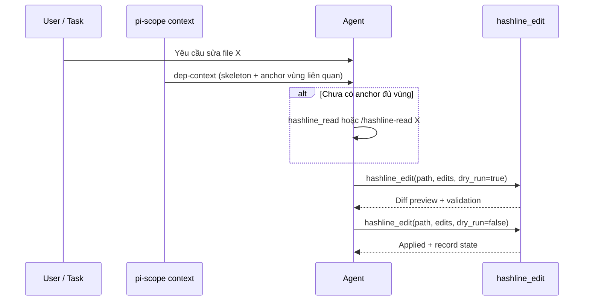
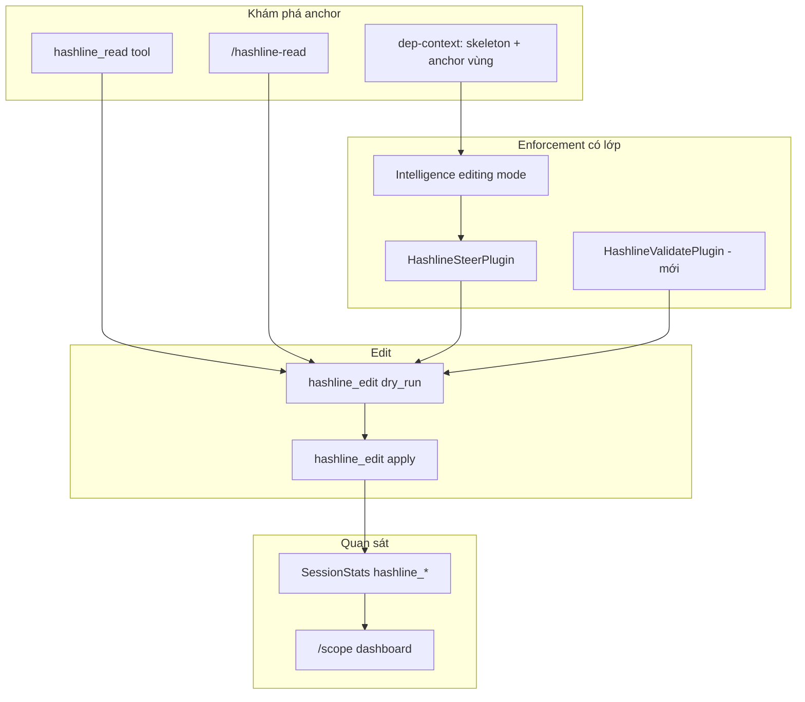

# Kế hoạch khai thác Hashline Editor — sử dụng đúng cách & mở rộng tiềm năng

> **Phiên bản:** 2.0 · **Ngày:** 2026-05-30  
> **Baseline code:** commit `67fab18` (`feat: integrate hashline anchors, read command, and edit steering`)  
> **Liên quan:** `docs/FEATURE_ANALYSIS_VI.md` §11, `docs/HASHLINE_EDITOR_PLAN_VI.md` (v1 — lịch sử), `skills/pi-scope-hashline/SKILL.md`

---

## 1. Tóm tắt điều hành

Hashline Editor là **cơ chế edit an toàn theo dòng** (`LINE+BIGRAM` + validate + rebase ±5 + `dry_run`). Core (`hashline/*`, `hashline_edit`) đã mature; vấn đề còn lại là **workflow adoption**: agent vẫn mặc định `read` → `edit`/`search_replace` vì quen thuộc, anchor chưa phủ đúng vùng edit, và enforcement mặc định là **gợi ý** chứ không **ép**.

**Mục tiêu v2:** Biến hashline thành **đường mặc định có điều kiện** khi sửa file đã index — đo được, document đúng, giảm drift — mà vẫn cho phép escape hatch (strictMode tắt / file chưa index).

| Trục | Hiện tại (sau 67fab18) | Mục tiêu v2 |
|------|------------------------|-------------|
| Khám phá anchor | Đầu file (≤80 dòng) trong dep-context; `/hashline-read` | Anchor **đúng vùng** symbol/dòng; tool `hashline_read` |
| Chọn tool edit | Steer notify; `strictMode` off | Steer **theo ngữ cảnh**; strict có thể bật theo profile |
| Đọc trước edit | `recordOnRead` nội bộ; read không show anchor | Agent **thấy** anchor trong tool result |
| Đo lường | Không có | Metrics trong `/scope` + session stats |
| Tài liệu | Skill/README lệch thực tế | Một nguồn sự thật, workflow rõ |

---

## 2. Định nghĩa “sử dụng đúng cách”

### 2.1 Workflow chuẩn (agent)



**Quy tắc bắt buộc (khi file đã index + có editing intent):**

1. **Không** dùng `edit` / `search_replace` / `write` cho thay đổi nội dung dòng có anchor — dùng `hashline_edit`.
2. **Luôn** `dry_run: true` trên lần gọi đầu cho file đó trong turn (hoặc session, tùy config).
3. Anchor phải lấy từ: (a) block hashline trong dep-context, (b) `hashline_read` / `/hashline-read`, (c) output mismatch recovery — **không** đoán line number.
4. File > `annotateMaxLinesPerFile` hoặc edit ngoài vùng đã inject → **bắt buộc** full read có anchor trước edit.

### 2.2 Workflow chuẩn (người dùng / operator)

| Việc cần làm | Cách |
|---------------|------|
| Bật pi-scope | Mở repo code hợp lệ; `scope.enabled` true |
| Cấu hình profile | Xem §6 — `balanced` hoặc `strict` cho team |
| Sửa file lớn | `/hashline-read path/to/file.ts` trước khi nhờ agent edit |
| Review an toàn | Yêu cầu agent `dry_run: true` trước |
| Repo quan trọng | `strictMode: true` trong `.pi/scope.jsonc` |

### 2.3 Điều **không** phải “dùng đúng”

- Dùng hashline để edit file **chưa index** (node_modules, file mới ngoài exclude) — built-in edit OK.
- Edit **tạo file mới** chỉ với `loc: append|prepend` — không cần anchor cũ.
- Thay thế **toàn bộ file** (migrate, codegen dump) — có thể dùng `write` có chủ đích; ghi trong task.

---

## 3. Hiện trạng sau tích hợp (baseline)

### 3.1 Đã triển khai ✅

| Thành phần | File | Ghi chú |
|------------|------|---------|
| `hashline_edit` tool | `tools/hashline-editor.ts` | dry_run, diff preview |
| `/hashline-read` | `commands/hashline-read.ts`, `extension.ts` | Slash command |
| Dep-context anchors | `context/hashline-inject.ts`, `dep-context.ts` | N dòng đầu file, budget-aware |
| Preamble sớm | `manager.ts` `handleBeforeAgentStart` | Trước repo-map content |
| `HashlineSteerPlugin` | `plugins/hashline-steer-plugin.ts` | Notify; block nếu `strictMode` |
| `recordOnRead` | `manager.ts` `handleToolCall` | Ghi `AnchorStateManager` khi `read` |
| `initHash` warmup | `manager.ts` `start()` | Session start |
| Config `slim.hashline` | `context/schema.ts` | 7 flags |
| Tests | `tests/commands/*`, `tests/context/hashline-inject.test.ts`, `tests/plugins/hashline-steer.test.ts` | 637 tests pass |

### 3.2 Chưa đạt “đúng cách hoàn toàn” ⚠️

| ID | Gap | Tác động |
|----|-----|----------|
| G1 | Anchor chỉ **đầu file** (default 80 dòng) | Edit giữa/cuối file → không có anchor trong context |
| G2 | Built-in `read` **không** trả `LINE+bigram\|` | Agent không thấy anchor dù state đã record |
| G3 | `/hashline-read` là command, không phải tool | Agent IDE có thể không gọi được |
| G4 | Steer mặc định **notify only** | `edit`/`search_replace` vẫn chạy |
| G5 | Skeleton AST ≠ block anchor raw | Skill nói “skeleton có anchor” — gây nhầm |
| G6 | Token budget bỏ anchor **im lặng** | `annotateDepContext: true` nhưng không inject |
| G7 | Không metric adoption | Không tuning được |
| G8 | `AnchorStateManager` dùng `simpleHash`; validate dùng `computeLineHash` | Reconcile best-effort, không thống nhất |
| G9 | Chưa block `hashline_edit` khi anchor stale | FEATURE_ANALYSIS §9 cơ hội chưa làm |
| G10 | Intelligence `hasHashAnnotations` chưa gắn dep-context inject | Gợi ý hashline thiếu tín hiệu từ inject thực tế |

---

## 4. Kiến trúc mục tiêu (to-be)



**Nguyên tắc thiết kế (giữ từ v1):**

- **Không** resurrect `ReadAwarenessPlugin` (block edit without read).
- **Hai mode annotation:** skeleton (overview) + full/slice có anchor (edit truth).
- **Enforcement theo lớp:** gợi ý → notify → contextual strict → global strict.

---

## 5. Ma trận khai thác tiềm năng

| # | Tính năng | Giá trị | Effort | Phase |
|---|-----------|---------|--------|-------|
| P1 | Tool `hashline_read` (mirror `/hashline-read`) | Agent luôn gọi được; output trong tool result | 1d | **A** |
| P2 | Anchor **theo symbol / line range** | Đúng vùng edit; ít token hơn full file | 2d | **A** |
| P3 | `hasHashAnnotations` từ dep-context thực tế | Intelligence gợi ý đúng lúc | 0.5d | **A** |
| P4 | Metrics hashline trong tracker + `/scope` | Đo ROI, phát hiện misuse | 1d | **B** |
| P5 | Contextual strict (edit block khi có anchor in-turn) | Enforcement không cần global strict | 1d | **B** |
| P6 | `HashlineValidatePlugin` (stale → gợi ý re-read) | Giảm edit sai dòng | 1d | **B** |
| P7 | `preferDryRun` coerce/warn lần đầu | Tăng dry_run rate | 0.5d | **B** |
| P8 | Align `AnchorStateManager` với `computeLineHash` | Reconcile đáng tin | 1d | **C** |
| P9 | LSP hover kèm anchor dòng | Navigation → edit liền mạch | 1–2d | **C** |
| P10 | Stream annotate file lớn (`ChunkEmitter`) | File 1k+ dòng | 2d | **D** |
| P11 | Diff follow-up inject sau dry_run | Agent review trong context | 1d | **D** |
| P12 | Skill + README + FEATURE_ANALYSIS sync | Giảm misuse | 0.5d | **A** (song song) |

---

## 6. Cấu hình theo profile

Đặt trong `.pi/scope.jsonc` (hoặc `~/.pi/agent/scope.jsonc`):

### 6.1 Permissive (mặc định hiện tại — onboarding)

```jsonc
{
  "hashline": {
    "enabled": true,
    "annotateDepContext": true,
    "annotateMaxLinesPerFile": 80,
    "preferDryRun": true,
    "steerFromBuiltinEdit": true,
    "strictMode": false,
    "recordOnRead": true
  }
}
```

**Dùng khi:** Làm quen pi-scope; agent hay dùng built-in edit; không muốn block.

### 6.2 Balanced (khuyến nghị team)

```jsonc
{
  "hashline": {
    "enabled": true,
    "annotateDepContext": true,
    "annotateMaxLinesPerFile": 120,
    "annotateBySymbolRange": true,
    "annotateRangePaddingLines": 15,
    "preferDryRun": true,
    "steerFromBuiltinEdit": true,
    "contextualStrictMode": true,
    "strictMode": false,
    "recordOnRead": true,
    "hashlineReadAsTool": true
  }
}
```

*`annotateBySymbolRange`, `contextualStrictMode`, `hashlineReadAsTool` — thêm trong Phase A/B.*

### 6.3 Strict (repo production / shared libs)

```jsonc
{
  "hashline": {
    "enabled": true,
    "annotateDepContext": true,
    "annotateMaxLinesPerFile": 150,
    "annotateBySymbolRange": true,
    "preferDryRun": true,
    "steerFromBuiltinEdit": true,
    "strictMode": true,
    "recordOnRead": true,
    "hashlineReadAsTool": true
  }
}
```

**Dùng khi:** God-node edits, nhiều contributor, cần giảm drift tối đa.

---

## 7. Kế hoạch triển khai theo phase

### Trạng thái v1 (đã xong) — tham chiếu `HASHLINE_EDITOR_PLAN_VI.md`

| Phase v1 | Nội dung | Trạng thái |
|----------|----------|------------|
| 0 | Sửa tool description | ✅ |
| 1 | `/hashline-read` | ✅ |
| 2 | dep-context inject (đầu file) | ✅ |
| 3 | Preamble sớm | ✅ |
| 4 | HashlineSteerPlugin | ✅ |
| 5 | recordOnRead + initHash | ✅ |
| 6 | Metrics mismatch (một phần) | ⬜ polish |

---

### Phase A — Đóng gap “agent không thấy / không có anchor đúng chỗ” (3–4 ngày)

**Mục tiêu:** Agent có anchor **trong tool result** và **đúng vùng** cần sửa.

#### A.1 Tool `hashline_read`

| Task | Chi tiết |
|------|----------|
| File | `tools/hashline-read.ts` (hoặc mở rộng `hashline-editor.ts`) |
| API | `defineTool({ name: 'hashline_read', ... })` — delegate `formatHashlineRead` |
| Params | `path`, optional `startLine`, `endLine`, `maxLines` |
| Output | Text có `LINE+bigram\|content`; ghi `AnchorStateManager` |
| Register | `extension.ts` cạnh `registerHashlineTool` |

**Acceptance:** Agent gọi `hashline_read` → nhận ≥1 dòng `^\d+[a-z]{2}\|`; test integration với `hashline_edit` dry_run.

#### A.2 Anchor theo symbol / line range

| Task | Chi tiết |
|------|----------|
| File | `context/hashline-inject.ts`, `context/hashline-region.ts` (mới) |
| Logic | Từ `RetrievalEngine` / symbol trong message / `file.ts:42` → map line range qua index hoặc đọc file |
| Inject | `formatHashLines(slice)` cho `[line- padding, line+ padding]` thay vì chỉ `0..N` |
| Fallback | Không resolve được range → giữ behavior đầu file |
| Config | `annotateBySymbolRange`, `annotateRangePaddingLines` |

**Acceptance:** Message `"fix authenticate in src/auth.ts:42"` → dep-context chứa anchor quanh dòng 42 (±padding).

#### A.3 Intelligence ↔ inject

| Task | Chi tiết |
|------|----------|
| File | `manager.ts` `handleContext`, `context/intelligence-engine.ts` |
| Logic | Set `insights.editingIntent.hasHashAnnotations = true` khi dep-context slice có hash block |
| Turn mode | `editing` + hasHashAnnotations → block workflow ngắn đầu **per-turn context** (priority 3.5 pipeline) |

**Acceptance:** Sau inject anchor, `generateActionableGuidance` chứa bước `hashline_edit` dry_run.

#### A.4 Documentation sync (song song)

| File | Thay đổi |
|------|----------|
| `skills/pi-scope-hashline/SKILL.md` | Tách rõ skeleton vs anchor block; ưu tiên `hashline_read` tool |
| `README.md` | Workflow 3 bước + link profile config |
| `docs/FEATURE_ANALYSIS_VI.md` | §11.4 cập nhật roadmap v2 |

---

### Phase B — Enforcement có điều kiện & đo lường (2–3 ngày)

#### B.1 Contextual strict mode

```typescript
// plugins/hashline-steer-plugin.ts
// strict khi: strictMode OR (contextualStrictMode && hasAnchorInTurn(path) && editingIntent)
```

| Task | Chi tiết |
|------|----------|
| `hasAnchorInTurn` | Session flag set khi dep-context / hashline_read inject anchor cho path |
| Block | `allowed: false` + reason kèm `hashline_read` / `hashline_edit` |

**Acceptance:** Có anchor in-turn + `edit` trên cùng path → block (contextual strict); không anchor → allow.

#### B.2 `preferDryRun` enforcement

| Task | Chi tiết |
|------|----------|
| Track | `filesEditedWithoutDryRun: Set` trên session hoặc stats |
| Lần đầu `hashline_edit` không dry_run | Warn qua telemetry; optional auto-set dry_run=true (config `coerceDryRun`) |

#### B.3 Metrics

| Metric | Nơi ghi |
|--------|---------|
| `hashlineEditsTotal` | `metrics/tracker.ts` |
| `hashlineDryRuns` | |
| `hashlineMismatches` | Hook `HashlineMismatchError` |
| `builtinEditSteered` | Steer plugin |
| `anchorsInjectedTurns` | dep-context |

**Surface:** `commands/scope-dashboard.ts` section “Hashline”.

**Acceptance:** `/scope` hiển thị counts; test unit cho tracker.

#### B.4 `HashlineValidatePlugin` (optional trong B)

- Trước `hashline_edit` apply (không dry_run): nếu path chưa `record` trong session → steer `hashline_read` trước.
- Không block dry_run (validation chính là dry_run).

---

### Phase C — Độ tin cậy state & LSP (2 ngày)

#### C.1 Unify hash trong `AnchorStateManager` ✅

- `record()` / reconcile dùng cùng pipeline `computeLineHash` (hoặc document rõ reconcile chỉ map line shift).
- Test: shift ±3 dòng, content giữ → rebase thành công.

#### C.2 LSP + anchor ✅

- `lsp_hover` response thêm section **Hashline anchor** (`hashline/lsp-hover-anchor.ts`).
- Gợi ý `hashline_edit` + `hashline_read` quanh dòng hover; config `anchorOnLspHover`.
- `hashline_edit` bắt `HashlineMismatchError` → `displayMessage` + `hashlineMismatches` trên `/scope`.

---

### Phase D — File lớn & UX nâng cao ✅

| Task | Mô tả | Trạng thái |
|------|--------|------------|
| Chunk stream | `hashline/streaming.ts` — chunked annotate khi slice ≥ `streamAnnotateThresholdLines` (500) | ✅ |
| Post dry_run context | `context/hashline-dry-run-followup.ts` — inject turn tiếp (priority 8) | ✅ |
| Mismatch recovery | `hashline_read` path + `start_line`/`end_line` ±3 quanh mismatch | ✅ |

---

## 8. Hướng dẫn vận hành (playbook)

### 8.1 Cho agent (đưa vào AGENTS.md / CLAUDE.local.md)

```markdown
## Editing code in this repo (pi-scope hashline)

1. If pi-scope injected hashline anchors for the target file, use `hashline_edit` with `dry_run: true` first.
2. If editing below line 80 or anchors are missing, call `hashline_read` (or `/hashline-read <path>`) before editing.
3. Do not use `edit` / `search_replace` on indexed source files unless the user explicitly asks.
4. Reference edits by LINE+bigram anchors (e.g. `42nd`), not guessed line numbers.
5. After dry_run looks correct, call `hashline_edit` again with `dry_run: false`.
```

### 8.2 Cho reviewer PR

- [ ] Agent transcript dùng `hashline_edit` cho thay đổi logic trong file đã index?
- [ ] Có `dry_run` trước apply?
- [ ] Không có `search_replace` drift trên cùng file?

### 8.3 Checklist debug khi hashline “không hoạt động”

| Triệu chứng | Kiểm tra |
|-------------|----------|
| Không thấy anchor | `scope.enabled`, dep-context trigger, token budget, `annotateDepContext` |
| `HashlineMismatchError` | File đổi ngoài session → `hashline_read` lại |
| Vẫn dùng `edit` | `strictMode` / `contextualStrictMode`; steer có notify không |
| `/hashline-read` không chạy | Session active; path đúng project root |

---

## 9. Ma trận file (v2)

| File | Phase | Thay đổi |
|------|-------|----------|
| `tools/hashline-read-tool.ts` | A | **Mới** — `hashline_read` tool |
| `context/hashline-region.ts` | A | **Mới** — resolve line range |
| `context/hashline-inject.ts` | A | Region-aware annotate |
| `context/dep-context.ts` | A | Truyền region hints |
| `context/schema.ts` | A,B | Flags mới |
| `manager.ts` | A,B | hasHashAnnotations, per-turn block, metrics hooks |
| `plugins/hashline-steer-plugin.ts` | B | contextual strict |
| `plugins/hashline-validate-plugin.ts` | B | **Mới** (optional) |
| `metrics/tracker.ts` | B | hashline counters |
| `commands/scope-dashboard.ts` | B | Hashline section |
| `hashline/state-manager.ts` | C | Unify hash |
| `tools/lsp-navigation.ts` | C | Anchor in hover |
| `skills/pi-scope-hashline/SKILL.md` | A | Sync |
| `docs/FEATURE_ANALYSIS_VI.md` | A | §11 roadmap |

---

## 10. Thứ tự PR & MVP

```
Phase A (anchor đúng + tool read) ──► Phase B (enforce + metrics)
         │                                    │
         └──────────────► Phase C (reliability + LSP)
                              │
                              └──► Phase D (optional)
```

| PR | Phạm vi | Ước lượng |
|----|---------|-----------|
| **PR-1** | A.1 + A.4 + A.3 (tool read, docs, intelligence flag) | ~2d |
| **PR-2** | A.2 (symbol/line region inject) | ~2d |
| **PR-3** | B.1 + B.3 (contextual strict + metrics) | ~2d |
| **PR-4** | B.2 + B.4 + C.1 | ~2d |
| **PR-5** | C.2 + D (nếu cần) | ~2–3d |

**MVP khai thác đúng cách (PR-1 + PR-2):** Agent có `hashline_read` + anchor đúng vùng → đủ để workflow chuẩn §2.1.

---

## 11. Definition of Done — “Hashline adoption v2”

### Cấp độ 1 — Sử dụng đúng cơ bản

- [ ] Tool `hashline_read` registered và có test
- [ ] Dep-context inject anchor **theo symbol/line** khi resolve được (fallback đầu file)
- [ ] Skill/README không còn claim sai về skeleton/read
- [ ] `hasHashAnnotations` phản ánh inject thực tế
- [ ] Playbook §8.1 trong project context file

### Cấp độ 2 — Khai thác có kiểm soát

- [ ] Contextual strict hoặc profile `balanced` documented
- [ ] `/scope` hiển thị hashline metrics
- [ ] `preferDryRun` warn hoặc coerce (config)
- [ ] FEATURE_ANALYSIS §11: sử dụng **đầy đủ** (không còn “một phần”)

### Cấp độ 3 — Tối ưu

- [ ] AnchorStateManager hash aligned
- [ ] LSP hover có anchor
- [ ] Mismatch / dry_run surfaced trong metrics

---

## 12. Rủi ro & giảm thiểu

| Rủi ro | Giảm thiểu |
|--------|------------|
| Token tăng khi annotate theo region | Padding có giới hạn; cap `annotateMaxLinesPerFile` |
| Contextual strict gây frustrate | Chỉ bật khi đã inject anchor; escape: `strictMode: false` |
| Agent ignore tool `hashline_read` | Intelligence per-turn + playbook; metric theo dõi |
| Hai tool read (`read` vs `hashline_read`) | Doc rõ; steer khi edit without hashline_read |
| Breaking CI khi strict trong OSS | Default permissive; strict chỉ document cho prod |

---

## 13. Liên kết nhóm pi-scope

| Nhóm | Liên hệ hashline v2 |
|------|---------------------|
| Dep-context | Điểm inject anchor region |
| Intelligence Engine | `editing` mode, `hasHashAnnotations`, per-turn workflow |
| Plugin System | Steer, Validate, metrics hooks |
| Metrics & Tracking | Counters + dashboard |
| LSP Navigation | Anchor tại hover |
| File Detector | Path từ tool → trigger region resolve |

---

## 14. So sánh v1 → v2

| Khía cạnh | HASHLINE_EDITOR_PLAN v1 | HASHLINE_ADOPTION_PLAN v2 |
|-----------|-------------------------|---------------------------|
| Trọng tâm | Wire tính năng còn thiếu | **Adoption + khai thác** |
| `/hashline-read` | Phase 1 (chưa có) | ✅ Done → thêm **tool** |
| dep-context | First N lines | **Symbol/line region** |
| Enforcement | Steer notify | **Contextual strict + metrics** |
| Đo lường | Optional Phase 6 | **Bắt buộc Phase B** |
| Operator | Không có | **Playbook §8** |

---

*Tài liệu spec triển khai v2. Ưu tiên PR-1 (`hashline_read` tool + doc + intelligence flag) rồi PR-2 (anchor theo vùng).*
