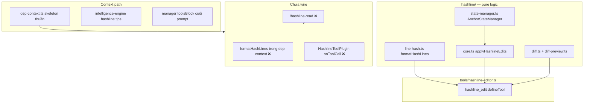

# Kế hoạch kích hoạt đầy đủ Nhóm 10: Hashline Editor

> Dựa trên `docs/FEATURE_ANALYSIS_VI.md` §11, khảo sát codebase (2026-05-30), sau commit metrics (`feat: expose session metrics…`).  
> **Phát hiện quan trọng:** `/hashline-read` được document nhưng **chưa được implement** trong `extension.ts`; dep-context **không** inject anchor — skill/README nói có nhưng code chưa wire `formatHashLines`.

---

## 1. Mục tiêu

Biến Hashline từ “tool có sẵn + gợi ý thụ động” thành **workflow mặc định** khi agent edit file đã có trong context:

| Mục tiêu | Hiện trạng | Mong muốn |
|----------|------------|-----------|
| Agent luôn thấy anchor | Chỉ nếu tự gọi `/hashline-read` (không tồn tại) | Anchor trong dep-context hoặc lệnh read |
| Edit an toàn | `dry_run` có trong schema | Mặc định gợi ý dry_run trước write |
| Giảm StrReplace drift | PatternDetector gợi ý | Routing / steer mạnh hơn tại `onToolCall` |
| Stale anchor | `HashlineMismatchError` + rebase ±5 | Stateful reconcile + record sau read |
| Guidance được đọc | `toolsBlock` ở cuối system prompt | Block hashline sớm hơn + trong intelligence |

---

## 2. Kiến trúc hiện tại (as-is)



### 2.1 Đã có và hoạt động

| Thành phần | File | Ghi chú |
|------------|------|---------|
| `hashline_edit` tool | `tools/hashline-editor.ts` | Register trong `extension.ts`; `dry_run`, diff preview |
| Anchor format | `hashline/line-hash.ts` | `formatHashLine`, `formatHashLines`, `computeLineHash` |
| Apply + validate | `hashline/core.ts` | 6 ops; rebase ±5; `HashlineMismatchError` |
| Stateful reconcile | `hashline/state-manager.ts` | Myers diff khi có `filePath` trong `applyHashlineEdits` |
| Tests | `tests/hashline/*`, `tests/tools/hashline-schema.test.ts` | Core coverage tốt |
| Intelligence gợi ý | `context/pattern-detector.ts`, `intelligence-engine.ts` | StrReplace → suggest `hashline_edit` |
| Prompt mention | `manager.ts` `toolsBlock` | 5 dòng tool overview |

### 2.2 Gap so với documentation

| Tài liệu nói | Thực tế code |
|--------------|--------------|
| `/hashline-read <file>` | **Không có** `registerCommand` — chỉ string trong `toolsBlock` |
| “Skeletons include anchors automatically” (`pi-scope-hashline` skill) | `dep-context` inject `index.skeletons` **không** qua `formatHashLines` |
| `Read the file first via the read tool to see anchor-annotated content` (tool description) | Built-in `read` **không** annotate — misleading |
| ReadAwarenessPlugin | **Đã xóa** (mâu thuẫn skeleton-first workflow) |

### 2.3 Vấn đề §11 (vẫn đúng)

1. **Guidance position:** `toolsBlock` append **sau** `result.content` trong `handleBeforeAgentStart` — weight thấp.
2. **Passive suggestion:** Không block/redirect `edit` / `search_replace` sang `hashline_edit`.
3. **Anchor discovery:** Agent dùng `read` → không có `42nd|` prefix → không edit được bằng anchor (trừ khi đoán line number).

---

## 3. Khoảng trống (gap analysis)

| ID | Gap | Mức | Ghi chú |
|----|-----|-----|---------|
| H1 | `/hashline-read` chưa implement | **Critical** | Doc/skill drift |
| H2 | Dep-context không có anchors | **Critical** | Core value proposition |
| H3 | `AnchorStateManager.record` không gọi khi read | Cao | Reconcile yếu nếu agent không qua hashline_edit |
| H4 | Tool description sai về built-in `read` | Trung bình | Gây misuse |
| H5 | Guidance cuối prompt | Trung bình | §11.3 |
| H6 | Không `onToolCall` steer | Trung bình | §11.4, §9 plugins |
| H7 | `initHash()` lazy per edit — OK | Thấp | Có thể warm-up lúc session start |
| H8 | Skeleton ≠ full file — anchor cần full content cho edit | **Design** | Xem §4.2 |

---

## 4. Nguyên tắc thiết kế

### 4.1 Hai mode annotation

| Mode | Nguồn | Khi nào |
|------|-------|---------|
| **Skeleton + anchor** | AST skeleton + optional line refs | Dep-context, tiết kiệm token |
| **Full file + anchor** | `formatHashLines(readFile)` | `/hashline-read`, trước edit phức tạp |

Skeleton chỉ có signatures — **không đủ** để replace nội dung dòng arbitrary. Plan:

- Dep-context: inject **header** “Hash anchors for this file (use `/hashline-read` or `hashline_edit` after read)” + **optional** `formatHashLines` cho N dòng đầu / vùng symbol match (phase 2).
- `/hashline-read`: **full file** annotated — nguồn truth cho edit.

### 4.2 Không resurrect ReadAwarenessPlugin

ADR: skeleton injection = implicit read. Plugin block `edit` without read đã bị xóa đúng. Thay bằng **steer**, không block (trừ khi user bật `hashline.strictMode`).

### 4.3 Config `slim.hashline`

```jsonc
{
  "hashline": {
    "enabled": true,
    "annotateDepContext": true,
    "annotateMaxLinesPerFile": 80,
    "preferDryRun": true,
    "steerFromBuiltinEdit": true,
    "recordOnRead": true
  }
}
```

---

## 5. Kế hoạch triển khai theo phase

### Phase 0 — Sửa doc drift & mô tả tool (0.5 ngày)

**Mục tiêu:** Documentation khớp code; tránh hướng agent sai.

| Task | File |
|------|------|
| Sửa tool `description`: “use `/hashline-read` or dep-context; built-in `read` does not include anchors” | `tools/hashline-editor.ts` |
| Sửa skill `pi-scope-hashline`: bỏ claim “skeletons include anchors” cho đến Phase 1 | `skills/pi-scope-hashline/SKILL.md` |
| README § Hashline: note `/hashline-read` planned hoặc implement ngay Phase 1 | `README.md` |

**Acceptance:** Không còn câu “built-in read shows anchors”.

---

### Phase 1 — `/hashline-read` command (1 ngày) — **MVP blocker**

**Mục tiêu:** Lệnh thật thay vì string trong `toolsBlock`.

#### 1.1 Module mới `commands/hashline-read.ts`

```typescript
export async function formatHashlineRead(projectRoot: string, fileArg: string): Promise<string>
```

- Resolve path relative `projectRoot`
- `readFile` → `initHash()` → `formatHashLines(content)`
- `AnchorStateManager.record(absPath, content)` khi `hashline.recordOnRead`
- Output: header + annotated content (truncate nếu > budget, cảnh báo)

#### 1.2 Register command

```typescript
pi.registerCommand('hashline-read', {
  description: 'Read file with hashline anchors (LINE+BIGRAM|content)',
  handler: async (args) => formatHashlineRead(manager.state!.projectRoot, args ?? ''),
})
```

Hoặc subcommand: document `hashline-read` as separate command name (pi convention).

#### 1.3 Tests

- `tests/commands/hashline-read.test.ts`: fixture file → output contains `1xx|`
- Integration: sau read, `hashline_edit` dry_run với anchor line 1 thành công

**Acceptance:** User/agent gọi lệnh và nhận `42nd|...` lines.

---

### Phase 2 — Auto-inject anchors trong dep-context (1–2 ngày)

**Mục tiêu:** Agent thấy anchor khi file đã inject — không cần bước riêng cho edit đơn giản.

| Task | Chi tiết |
|------|----------|
| `hashline/annotate.ts` | `annotateSkeletonForHashline(skeleton, fullPath, opts)` — đọc file disk, map skeleton lines → anchors (heuristic) HOẶC append block `## Hashline (first N lines)` |
| **Pragmatic v1** | Sau `### path` trong dep-context, append fenced block: first `annotateMaxLinesPerFile` lines của file thật qua `formatHashLines` |
| Token budget | Trừ vào `maxInjectionTokens`; skip nếu hết budget |
| `hasHashAnnotations` | Set true trong intelligence khi dep-context có hash block |

**File:** `context/dep-context.ts`, `context/hashline-inject.ts` (helper), `context/schema.ts`

**Acceptance:** `<dep-context>` chứa ít nhất một dòng `^\d+[a-z]{2}\|` cho file in-focus; intelligence `hasHashAnnotations` true.

---

### Phase 3 — Guidance & prompt placement (0.5–1 ngày)

| Task | Chi tiết |
|------|----------|
| **Early hashline block** | Trong `handleBeforeAgentStart`, prepend ngắn (3 dòng) *trước* repo-map: “Editing: hashline_edit + dry_run first” |
| **Intelligence** | Đã có — tăng `hasHashAnnotations` trigger từ dep-context |
| **toolsBlock** | Giữ nhưng rút gọn; tránh trùng intelligence |
| **Repo-map note** | Một dòng: “Full anchors: `/hashline-read path`” |

**Acceptance:** System prompt có hashline guidance trong 30% đầu content injected.

---

### Phase 4 — `onToolCall` steering plugin (1 ngày)

**Mục tiêu:** Khi agent gọi built-in `edit` / `search_replace` / `write` trên file đã trong index.

#### `plugins/hashline-steer-plugin.ts`

```typescript
async onToolCall(event, ctx): Promise<PluginToolCallResult | undefined> {
  if (!config.hashline.steerFromBuiltinEdit) return undefined
  const path = extractPath(event)
  if (!path || !isIndexed(path)) return undefined
  return {
    allowed: true, // không block mặc định
    message: 'Prefer hashline_edit with anchors from dep-context or /hashline-read. Use dry_run: true first.',
  }
}
```

Optional **strict mode:** `allowed: false` + reason (config).

Wire: `manager.ts` → `pluginManager.register(new HashlineSteerPlugin(...))`

**Tests:** `tests/plugins/hashline-steer.test.ts`

**Acceptance:** `handleToolCall` với `edit` trên indexed file trả message steer (không crash).

---

### Phase 5 — Read path & state recording (0.5 ngày)

| Task | Chi tiết |
|------|----------|
| Hook `read` tool results | Trong `handleToolCall` hoặc plugin: nếu `toolName === 'read'` và path indexed → `AnchorStateManager.record` |
| `hashline_edit` post-write | Đã `record` sau apply trong `core.ts` |
| Telemetry | `onHashlineEdit(applied|dry_run|mismatch)` |

**Acceptance:** Sau built-in read, reconcile trên edit tiếp theo ít mismatch hơn (test với shifted file).

---

### Phase 6 — Dry-run UX & mismatch recovery (0.5–1 ngày)

| Task | Chi tiết |
|------|----------|
| Diff preview | Đã có `buildCompactHashlineDiffPreview` — đảm bảo intelligence nhắc “review diff then apply without dry_run” |
| Mismatch | `HashlineMismatchError.formatDisplayMessage` — surface trong tool result (đã có); thêm gợi ý `/hashline-read` trong error text |
| Metrics | `SessionStats.recordHashlineEdit(dryRun, applied, mismatches)` optional |

---

## 6. Ma trận file

| File | Phase | Thay đổi |
|------|-------|----------|
| `commands/hashline-read.ts` | 1 | **Mới** |
| `extension.ts` | 1 | `registerCommand('hashline-read')` |
| `context/hashline-inject.ts` | 2 | **Mới** — format lines cho dep-context |
| `context/dep-context.ts` | 2 | Gọi inject helper |
| `context/schema.ts` | 2 | `hashline` config |
| `manager.ts` | 3 | Early guidance, toolsBlock |
| `plugins/hashline-steer-plugin.ts` | 4 | **Mới** |
| `tools/hashline-editor.ts` | 0 | Fix description |
| `hashline/state-manager.ts` | 5 | Optional: align hash với `computeLineHash` |
| `docs/FEATURE_ANALYSIS_VI.md` | 6 | §11 → ✅ |
| `skills/pi-scope-hashline/SKILL.md` | 0–6 | Sync |

---

## 7. Rủi ro & giảm thiểu

| Rủi ro | Giảm thiểu |
|--------|------------|
| Token explosion khi annotate full files | `annotateMaxLinesPerFile`, budget trong dep-context |
| Skeleton vs full file confusion | Doc rõ: skeleton = overview; edit = hashline-read hoặc annotated slice |
| `initHash` async trong sync path | Warm-up `initHash()` trong `SessionManager.start` |
| Agent vẫn dùng StrReplace | Steer message + intelligence; không block unless strict |
| State manager hash ≠ line-hash | Phase 5: unify hoặc document “reconcile is best-effort” |

**Lưu ý kỹ thuật:** `AnchorStateManager` dùng `simpleHash` trong khi validate dùng `computeLineHash` — nên **align** trong Phase 5 để reconcile đáng tin.

---

## 8. Thứ tự ưu tiên & MVP

```
Phase 0 (doc) ──► Phase 1 (/hashline-read) ──► Phase 2 (dep-context anchors)
         │                    │
         └────────────────────┴──► Phase 3 (guidance) ──► Phase 4 (steer)
                                      │
                                      └──► Phase 5–6 (polish)
```

**MVP (1 PR):** Phase 0 + Phase 1 + Phase 3 (minimal).  
**PR 2:** Phase 2 + Phase 4.  
**PR 3:** Phase 5–6 + metrics.

---

## 9. Definition of Done (kích hoạt đầy đủ)

- [ ] `/hashline-read` hoạt động và có test
- [ ] Dep-context inject hashline block (configurable) cho file in-focus
- [ ] Không còn doc claim sai về built-in `read`
- [ ] Hashline guidance xuất hiện sớm trong system prompt
- [ ] Plugin steer (hoặc strict) trên builtin edit tools
- [ ] `AnchorStateManager.record` sau read path
- [ ] `FEATURE_ANALYSIS_VI.md` §11 + item #9 trong §16 marked ✅
- [ ] Test suite pass; `graphify update` sau code change

---

## 10. Liên kết nhóm khác

| Nhóm | Liên hệ |
|------|---------|
| Intelligence Engine | `hasHashAnnotations`, workflow “dry_run first” |
| Dep-context | Injection site cho anchors |
| Plugins | `onToolCall` pattern |
| Metrics | Track hashline vs dep-context savings |
| File Detector | Paths từ tool → trigger annotated inject |

---

*Tài liệu spec triển khai. Ưu tiên Phase 1 vì `/hashline-read` hiện là lỗ hổng giữa docs và code.*
