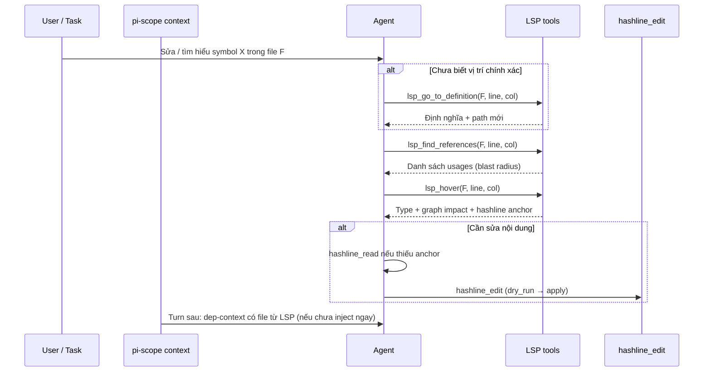
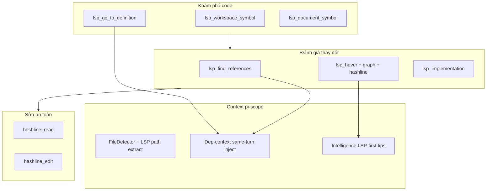

# Kế hoạch khai thác LSP Integration — sử dụng đúng cách & mở rộng tiềm năng

> **Phiên bản:** 1.0 · **Ngày:** 2026-05-30  
> **Baseline code:** commit `9cfb028` (hashline adoption v2 hoàn tất; LSP core đã có từ trước)  
> **Liên quan:** `docs/FEATURE_ANALYSIS_VI.md` §10, `ARCHITECTURE.md` §5, `skills/pi-scope-config/SKILL.md`, `README.md` (LSP Code Navigation)

---

## 1. Tóm tắt điều hành

LSP Integration trong pi-scope **đã có hạ tầng mature** (`lsp/client.ts`, `lsp/service.ts`, 3 tool LLM) nhưng **chưa được khai thác như một workflow mặc định**. Agent vẫn ưu tiên `read` / `grep` / đọc full file vì quen thuộc, trong khi LSP trả về định nghĩa, reference và type với chi phí token thấp hơn nhiều.

**Vấn đề cốt lõi không phải “thiếu LSP”** mà là:

1. **Adoption** — thiếu enforcement, thiếu luồng “LSP trước, read sau”, kết quả LSP chỉ feed dep-context **turn sau**.
2. **Graph ↔ LSP alignment** — graph node dạng `file:path.ts:Symbol` nhưng enrichment thường lookup theo **tên symbol rời** → dễ miss hoặc match nhầm file.
3. **Surface area** — client đã implement `documentSymbol`, `workspaceSymbol`, `implementation`, diagnostics… nhưng **chưa expose** ra agent.
4. **Quan sát** — không metric, không health check server, khó tuning.

**Mục tiêu v1 (kế hoạch này):** Biến LSP thành **lớp điều hướng code mặc định** khi pi-scope active + có server — đo được, gắn graph/hashline, giảm read thừa — mà vẫn degrade gracefully khi không cài language server.

| Trục | Hiện tại | Mục tiêu |
|------|----------|----------|
| Khám phá symbol | Agent tự grep/read | `lsp_go_to_definition` / `workspaceSymbol` trước |
| Blast radius | Đọc nhiều file | `lsp_find_references` + graph impact |
| Type / context | `read` full file | `lsp_hover` (+ graph + hashline anchor) |
| Feed context | Turn **N+1** qua FileDetector | Turn **N** inject path từ LSP result |
| Graph enrichment | Symbol name fuzzy match | Lookup `file:rel/path:Symbol` ưu tiên |
| Đo lường | Không có | `/scope` + session stats |

---

## 2. Định nghĩa “sử dụng đúng cách”

### 2.1 Workflow chuẩn (agent)



**Quy tắc khi `scope.enabled` + language server khả dụng:**

| Ý định | Tool ưu tiên | Tránh |
|--------|--------------|-------|
| “Định nghĩa ở đâu?” | `lsp_go_to_definition` | `read` cả file chỉ để tìm function |
| “Ai gọi symbol này?” | `lsp_find_references` | `grep` toàn repo (trừ khi LSP fail) |
| “Type / docs / impact?” | `lsp_hover` | Đoán type từ skeleton |
| “Tìm symbol theo tên” | `lsp_workspace_symbol` (mới) | Liệt kê thư mục + read lần lượt |
| Sửa code | `hashline_edit` (sau hover/read anchor) | `edit` trên file đã có anchor |

**Thứ tự trước edit rủi ro cao (god node / shared API):**

1. `lsp_find_references`
2. `lsp_hover` (xem graph impact trong response)
3. `hashline_edit` dry_run → apply

### 2.2 Workflow chuẩn (operator)

| Việc | Cách |
|------|------|
| Cài server | `typescript-language-server`, `pyright-langserver`, `gopls`, `rust-analyzer` trên `$PATH` |
| Kiểm tra health | `/scope` (mục tiêu) hoặc gọi thử `lsp_hover` trên file `.ts` |
| Repo TS/JS | Ưu tiên TLS; đảm bảo có `tsconfig.json` / `package.json` |
| Kết hợp hashline | Bật `hashline.anchorOnLspHover` — hover đã có anchor (Phase C hashline) |

### 2.3 Điều **không** bắt buộc LSP

- File extension không có server (`SERVERS` trong `lsp/service.ts`).
- Task chỉ cần **nội dung text** (comment, markdown, config không có LS).
- LSP trả lỗi / timeout — fallback `read` + AST skeleton vẫn OK.
- Symbol search cross-repo khi `workspaceSymbol` không hỗ trợ đủ.

---

## 3. Hiện trạng (đánh giá chi tiết)

### 3.1 Đã triển khai ✅

| Thành phần | File | Ghi chú |
|------------|------|---------|
| LSP client (JSON-RPC) | `lsp/client.ts` | definition, references, hover, documentSymbol, workspaceSymbol, implementation, diagnostics (nội bộ) |
| Lazy server per language | `lsp/service.ts`, `lsp/launch.ts` | TS, Python, Go, Rust |
| 3 LLM tools | `tools/lsp-navigation.ts` | `lsp_go_to_definition`, `lsp_find_references`, `lsp_hover` |
| Graph-enhanced hover | `context/graph-lsp-hover.ts` | God node, community, impact BFS |
| Symbol từ hover text | `context/graph-node-id.ts` | `extractSymbolFromHoverText` |
| Hashline trên hover | `hashline/lsp-hover-anchor.ts` | Gợi ý anchor + `hashline_read` |
| Intelligence gợi ý LSP | `context/intelligence-engine.ts` | Workflow theo mode navigation/editing |
| Shutdown | `extension.ts` | `shutdownLsp()` khi session end |
| Tests | `tests/context/graph-lsp-hover.test.ts`, integration | Hover enrichment |

### 3.2 Gap — adoption & workflow ⚠️

| ID | Gap | Tác động |
|----|-----|----------|
| **L1** | Kết quả LSP **không inject cùng turn** | README nói “feed next turn” — agent mất context ngay sau goto-def |
| **L2** | Không plugin steer LSP | Agent vẫn `grep`/`read` dù intelligence đã gợi ý |
| **L3** | Không config `slim.lsp` | Không tắt/bật enrichment, health, steer từ JSONC |
| **L4** | Không metrics LSP | Không biết tool nào được gọi, fail rate |
| **L5** | Mô tả tool chung chung | Agent không biết **0-indexed** line/column; dễ gọi sai vị trí |
| **L6** | `goto-def` / `find-refs` output plain text | Không có `file:line:col` structured → FileDetector parse kém |

### 3.3 Gap — graph ↔ LSP alignment ⚠️

| ID | Gap | Tác động |
|----|-----|----------|
| **L7** | Graph node `file:src/auth.ts:authenticate` vs lookup `authenticate` | Trùng tên symbol khác file → enrichment sai |
| **L8** | `enhanceHoverWithGraphMetrics(symbol, …)` bỏ qua `relativeFilePath` | Chưa dùng path để resolve node ID chính xác |
| **L9** | Thiếu “imported by / reverse deps” trên hover | FEATURE_ANALYSIS §10.4 — chưa có top importers |
| **L10** | God node list dùng label, không map `file:path` | Một số god node vẫn file-level |

**Hướng fix (Phase B):** `resolveGraphNodeId(relPath, symbolHint)` → ưu tiên `file:${relPath}:${symbol}`, fallback stem file, rồi fuzzy.

### 3.4 Gap — API chưa khai thác ⚠️

| LSP capability (client) | Tool / surface | Ưu tiên |
|-------------------------|----------------|---------|
| `workspaceSymbol` | ❌ | 🔴 Cao — tìm symbol theo tên |
| `documentSymbol` | ❌ | 🟡 Trung — outline file, chọn line/col |
| `implementation` | ❌ | 🟡 Trung — interface → impl |
| Diagnostics | ❌ | 🟡 Trung — gắn bash/tsc output |
| `signatureHelp` | ❌ (chưa wire client public) | 🟢 Thấp |
| Call hierarchy | ❌ (types có, chưa expose) | 🟢 Thấp |

### 3.5 Gap — tài liệu lệch thời ⚠️

`FEATURE_ANALYSIS_VI.md` §10.3 vẫn mô tả bug `symbolFromPosition` (filename stem) — **đã sửa** bằng `extractSymbolFromHoverText` + `resolveHoverLookupKey`. Cần cập nhật §10 và trỏ sang kế hoạch này.

---

## 4. Kiến trúc mục tiêu (to-be)



**Nguyên tắc:**

- LSP = **điều hướng & đánh giá**; hashline = **sửa**; graph = **ưu tiên rủi ro**; AST skeleton = **ngữ cảnh rộng**.
- Mọi output LSP có path → đưa vào `extraPaths` **cùng turn** (khi budget cho phép).

---

## 5. Ma trận ưu tiên (impact × effort)

| P | Hạng mục | Impact | Effort | Phase |
|---|---------|--------|--------|-------|
| P1 | Same-turn inject path từ LSP results | 🔴 | 1–2d | **A** |
| P2 | `resolveGraphNodeId(relPath, symbol)` cho hover/impact | 🔴 | 1–2d | **B** |
| P3 | `LspSteerPlugin` — gợi ý khi detect grep/read thay LSP | 🔴 | 1d | **A** |
| P4 | Config `slim.lsp` + health trong `/scope` | 🟡 | 1d | **A** |
| P5 | Metrics: `lspToolCalls`, failures | 🟡 | 0.5d | **A** |
| P6 | Tool `lsp_workspace_symbol` | 🔴 | 1d | **C** |
| P7 | Reverse deps / top importers trên hover | 🟡 | 1d | **B** |
| P8 | `lsp_document_symbol` (outline → gợi ý line) | 🟡 | 1d | **C** |
| P9 | `lsp_implementation` | 🟡 | 0.5d | **C** |
| P10 | Diagnostics → intelligence / file paths | 🟡 | 2d | **D** |
| P11 | Batch parallel goto-def (multi-symbol) | 🟢 | 1d | **D** |
| P12 | Skill + FEATURE_ANALYSIS sync | 🟡 | 0.5d | **A** |

---

## 6. Kế hoạch triển khai theo phase

### Phase A — Adoption & observability (2–3 ngày)

**Mục tiêu:** Agent **được dẫn** dùng LSP; operator **thấy** LSP có hoạt động không.

#### A.1 Same-turn LSP path injection ✅

- `manager.ts` `handleToolCall`: sau khi allow, nếu tool `lsp_*` thành công → parse paths từ result text (regex `path:line:col` hoặc structured `details`).
- Lưu `lspResolvedPathsThisTurn: Set<string>` (tương tự `hashlineAnchorPathsThisTurn`).
- `handleContext`: merge vào `extraPaths` **trước** `buildInjection`.
- **Acceptance:** Sau `lsp_go_to_definition`, dep-context turn **hiện tại** (hoặc cùng pipeline) chứa file đích nếu còn budget.

#### A.2 `LspSteerPlugin` (notify, optional block) ✅

- `onToolCall`: khi `grep` / `read` với pattern “tìm definition” (heuristic: path + line number trong args, hoặc suboptimal pattern có sẵn) → notify “thử `lsp_go_to_definition`”.
- Config: `lsp.steerFromManualSearch: true`, `lsp.strictNavigation: false` (block hiếm khi cần).
- **Acceptance:** Test plugin; không block khi LSP unavailable.

#### A.3 Config schema `slim.lsp` ✅

```jsonc
"lsp": {
  "enabled": true,
  "enrichHoverWithGraph": true,
  "injectPathsSameTurn": true,
  "steerFromManualSearch": true,
  "strictNavigation": false,
  "hoverMaxReferencesListed": 10,
  "recordToolMetrics": true
}
```

- `produceDefaults()` + `shared/types.ts` + flags trong `extension.ts` (optional).

#### A.4 Metrics & `/scope` ✅

- `SessionStats`: `lspGoToDef`, `lspFindRefs`, `lspHover`, `lspErrors`.
- `commands/scope-dashboard.ts`: section **LSP** (counts + last error nếu có).

#### A.5 Docs & skill ✅

- `skills/pi-scope-lsp/SKILL.md` (mới) — workflow §2.1, index line/col, server install.
- Cập nhật `FEATURE_ANALYSIS_VI.md` §10 (xóa bug đã fix, trỏ plan này).

---

### Phase B — Graph ↔ LSP chính xác (2 ngày)

#### B.1 `resolveGraphNodeId(relPath, symbolHint)` ✅

- File mới: `context/graph-lsp-resolve.ts`.
- Thứ tự: `file:${relPath}:${symbol}` → match god node / graph node → stem file → `normalizeNodeIdForMatch`.
- `tools/lsp-navigation.ts` `resolveHoverLookupKey` → trả **node id** hoặc lookup key thống nhất.

#### B.2 Hover: reverse dependencies ✅

- Từ `RepoIndex.reverseDeps` hoặc graph incoming edges: “**Used by (top 3):** `fileA.ts`, …”.
- Chỉ khi có data; không block hover khi thiếu index.

#### B.3 Impact dùng đúng node

- `computeDependentFanout(nodeId, analysis)` với seed từ B.1 — giảm false LOW impact.

#### B.4 Tests

- Hover trên symbol trùng tên hai file → enrichment đúng file.
- Reverse deps hiển thị khi có edge.

---

### Phase C — Mở rộng tools (2–3 ngày)

#### C.1 `lsp_workspace_symbol` ✅

- Parameters: `query` (string), optional `limit`.
- Output: bảng `name | kind | path:line` — agent chọn rồi gọi hover/refs.

#### C.2 `lsp_document_symbol` ✅

- Parameters: `path`.
- Output: outline indented + gợi ý “dùng line/col 0-based cho hover”.

#### C.3 `lsp_implementation` ✅

- Cùng signature `path, line, column` như goto-def.
- Mô tả tool: “interface/abstract → concrete impl”.

#### C.4 Chuẩn hóa output & `details` ✅

- Mọi tool trả `details.paths: string[]` để A.1 không phụ thuộc regex fragile.

---

### Phase D — Diagnostics & UX nâng cao (tùy chọn, 2–3 ngày)

| Task | Mô tả |
|------|--------|
| LSP diagnostics surface | Subscribe diagnostics từ client; map file:line vào intelligence “compiler errors” |
| Bash/tsc output bridge | `FileDetector` + parse error `file.ts(12,5)` → gợi ý `lsp_hover` tại line |
| Server health probe ✅ | Session start: `probeLspServers()`; hiện trong `/scope` |
| Parallel batch ✅ | `lsp_go_to_definition_batch` khi message cite nhiều `file:line` |
| `signatureHelp` tool | Chỉ khi có nhu cầu API completion |

---

## 7. Hướng dẫn vận hành (playbook)

### 7.1 Cho agent (AGENTS.md / CLAUDE.local.md)

```markdown
## Code navigation (pi-scope LSP)

1. Prefer LSP over grep/read when locating symbols:
   - Definition → `lsp_go_to_definition`
   - Usages → `lsp_find_references`
   - Types & impact → `lsp_hover`
   - Search by name → `lsp_workspace_symbol` (when available)
2. Use 0-based line and column from citations `file.ts:42` → line=41, column=0 unless you have exact column.
3. Before editing shared symbols: find references → hover (check impact) → hashline_edit with dry_run.
4. If LSP errors, fall back to pi-scope skeleton / hashline_read — do not guess line numbers.
```

### 7.2 Cho reviewer PR

- [ ] Navigation task dùng LSP thay vì read nhiều file?
- [ ] High-impact edit có `lsp_find_references` trong transcript?
- [ ] Hover được gọi khi sửa API public / god node?

### 7.3 Debug checklist

| Triệu chứng | Kiểm tra |
|-------------|----------|
| `LSP error: No language server` | Binary trên PATH; extension file; `getLanguageId` |
| Hover không có graph | Graph analysis loaded? `/scope` graph section |
| Graph impact luôn LOW | Lookup key sai — xem Phase B |
| File không inject sau LSP | `injectPathsSameTurn`; token budget |
| Hashline anchor trên hover | `hashline.enabled` + `anchorOnLspHover` |

---

## 8. Ma trận file (v1)

| File | Phase | Thay đổi |
|------|-------|----------|
| `context/schema.ts` | A | `lsp` config block |
| `shared/types.ts` | A | Types |
| `manager.ts` | A | Same-turn paths, metrics hooks |
| `plugins/lsp-steer-plugin.ts` | A | **Mới** |
| `metrics/tracker.ts` | A | LSP counters |
| `commands/scope-dashboard.ts` | A | LSP section |
| `context/graph-lsp-resolve.ts` | B | **Mới** — node id resolution |
| `context/graph-lsp-hover.ts` | B | Reverse deps, use resolve |
| `tools/lsp-navigation.ts` | A–C | New tools, structured details |
| `lsp/service.ts` | C | Thin wrappers nếu cần |
| `skills/pi-scope-lsp/SKILL.md` | A | **Mới** |
| `docs/FEATURE_ANALYSIS_VI.md` | A | §10 refresh |
| `tests/plugins/lsp-steer.test.ts` | A | **Mới** |
| `tests/context/graph-lsp-resolve.test.ts` | B | **Mới** |

---

## 9. Thứ tự PR & MVP

```
Phase A (adoption + metrics) ──► Phase B (graph alignment)
         │                              │
         └──────────────► Phase C (new tools)
                              │
                              └──► Phase D (optional)
```

| PR | Phạm vi | Ước lượng |
|----|---------|-----------|
| **PR-L1** | A.1 + A.3 + A.4 + A.5 | ~2d |
| **PR-L2** | A.2 + metrics tests | ~1d |
| **PR-L3** | B.1 + B.2 + B.4 | ~2d |
| **PR-L4** | C.1 + C.2 + C.4 | ~2d |
| **PR-L5** | C.3 + D (nếu cần) | ~2d |

**MVP khai thác đúng (PR-L1 + PR-L3):** Same-turn inject + graph lookup đúng file:symbol + steer nhẹ — đủ để LSP thay phần lớn read/grep điều hướng.

---

## 10. Cấu hình gợi ý

### Balanced (mặc định đề xuất)

```jsonc
{
  "hashline": { "enabled": true, "anchorOnLspHover": true },
  "lsp": {
    "enabled": true,
    "enrichHoverWithGraph": true,
    "injectPathsSameTurn": true,
    "steerFromManualSearch": true,
    "strictNavigation": false,
    "recordToolMetrics": true
  }
}
```

### Navigation-strict (team lớn, API ổn định)

```jsonc
{
  "lsp": {
    "steerFromManualSearch": true,
    "strictNavigation": true
  },
  "hashline": {
    "contextualStrictMode": true
  }
}
```

### Minimal (CI / không cài LS)

```jsonc
{
  "lsp": { "enabled": true, "enrichHoverWithGraph": true, "injectPathsSameTurn": false, "steerFromManualSearch": false }
}
```

---

## 11. Tiêu chí hoàn thành (definition of done)

- [x] LSP tools mở rộng (goto-def, refs, hover, workspace/document symbol, implementation, batch).
- [x] Same-turn dep-context chứa file từ LSP (`collectLspPathsFromMessages` + `details.paths`).
- [x] Hover god node match đúng `file:path:symbol` (test `graph-lsp-resolve`).
- [x] `/scope` hiển thị LSP stats + server health.
- [x] `FEATURE_ANALYSIS_VI.md` §10 phản ánh trạng thái mới.
- [x] Skill `pi-scope-lsp` published trong repo.

---

## 12. Liên kết với Hashline Adoption

| Điểm chạm | Hashline | LSP |
|-----------|----------|-----|
| Hover | Anchor tại cursor | Type + graph |
| Trước edit | `hashline_read` | `find_references` |
| Enforcement | `HashlineSteerPlugin` | `LspSteerPlugin` (mới) |
| Metrics | `hashlineEdits`, mismatches | `lsp*` counters (mới) |

Hai kế hoạch **bổ sung nhau**: LSP trả lời “ở đâu / ai dùng / rủi ro gì”; hashline trả lời “sửa dòng nào an toàn”.

---

*Kế hoạch này bổ sung `HASHLINE_ADOPTION_PLAN_VI.md` (v2 done). Triển khai theo phase; mỗi PR nên kèm test và cập nhật §10 FEATURE_ANALYSIS khi đổi hành vi quan sát được.*
