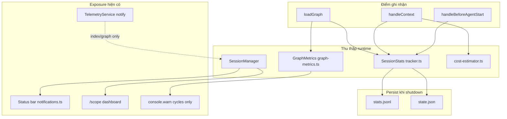

# Kế hoạch kích hoạt đầy đủ Nhóm 13: Metrics & Tracking

> Dựa trên đánh giá `docs/FEATURE_ANALYSIS_VI.md` §14, khảo sát codebase (2026-05-30), và trạng thái sau commit `e073598` (Intelligence Engine đã tinh chỉnh; `/scope` dashboard đã có phần injection cơ bản).

---

## 1. Mục tiêu

Biến **Metrics & Tracking** từ “thu thập ngầm” sang **quan sát được trong session**, **phản hồi khi shutdown**, và **phân tích xuyên session** — mà không phá zero-config.

| Mục tiêu người dùng | Hiện trạng | Trạng thái mong muốn |
|---------------------|------------|----------------------|
| Biết pi-scope tiết kiệm bao nhiêu token | `totalTokensSaved` chỉ trong `stats.jsonl` | Thấy trên `/scope`, status bar, thông báo khi kết session |
| Đánh giá chất lượng graph | `buildGraphMetricsSummary()` tính score 0–100 nhưng không hiển thị | Score + cảnh báo khi start nếu cycles/score thấp |
| Debug injection | `SessionStats` đầy đủ field | Dashboard chi tiết theo nguồn (repo-map, graph, intelligence, dep…) |
| So sánh các session | `stats.jsonl` append-only | Lệnh/xem trend 5–10 session gần nhất |
| Agent/human đọc được | Skill telemetry mô tả file | Skill + `/scope` đồng bộ với implementation |

---

## 2. Kiến trúc hiện tại (as-is)



### 2.1 `SessionStats` (`metrics/tracker.ts`) — đã hoạt động

**Được ghi khi:**

| Sự kiện | Method | Ghi chú |
|---------|--------|---------|
| Repo map inject (1 lần) | `recordRepoMapInjection` | `handleBeforeAgentStart` |
| Graph insights | `recordGraphInsightsInjection` | Cộng dồn tokens |
| Intelligence | `recordIntelligenceInjection` | Cộng dồn; mỗi turn `handleContext` |
| Smart dep context | `recordSmartDepContextInjection` | Mới từ IE refactor |
| Dep context | `recordDepContextInjection` | + `totalTokensSaved`, `savingsRatio`, file mentions |
| Provider / context files | tương ứng | Một lần / session |
| Index metadata | `recordIndexLoaded`, `recordIndexAge` | godNodesCount, communityCount, cycles |

**Chưa dùng trong product:**

- `summary()` — chuỗi ngắn cho status bar nhưng status bar dùng `buildStatusText()` riêng, **không** gọi `summary()`.
- `report()` — báo cáo đẹp multi-line, **không** gọi ở `shutdown()`.
- `toRecord()` thiếu nhiều field đã track live (graphInsights, intelligence, smartDep, graph quality).

### 2.2 `GraphMetrics` (`metrics/graph-metrics.ts`) — tính nhưng không surface

`loadGraph()` gọi `buildGraphMetricsSummary()` rồi chỉ:

```typescript
if (graphSummary.quality.cycleCount > 0) {
  console.warn(`[pi-scope] Graph: N circular dependencies detected`)
}
```

**Không** log quality score, throughput, estimated token savings. Comment trong file nói feed status bar / telemetry — **chưa wire**.

### 2.3 `/scope` (`commands/scope-dashboard.ts`) — partial exposure

Đã có: index, graph counts, injection tokens (repo-map, graph, intelligence, smart-dep, dep), savings nếu > 0, community prune từ plugin.

**Thiếu:** graph quality score, analysis time/cache hit, session duration, top files, breakdown % theo nguồn, lịch sử `stats.jsonl`.

### 2.4 Persist (`stats.jsonl`, `state.json`)

- `persist()` append 1 dòng JSON/session — **chỉ khi `shutdown()`**.
- `writeState(lastSession)` — subset nhỏ, **không** khớp `SessionRecord` đầy đủ.
- Không có module đọc / aggregate `stats.jsonl` (CONTRIBUTING.md gợi ý “recency” nhưng chưa implement).

### 2.5 Telemetry vs SessionStats

`TelemetryService`: notify index/graph/errors. **Không** ghi token savings, không gọi `recordTokens` từ pi-scope injection stats.

### 2.6 Skill vs code drift

`skills/pi-scope-telemetry/SKILL.md`: `SessionRecord` mẫu **thiếu** `graphInsightsTokens`, `intelligenceTokens`, `smartDepContextTokens` — cần sync sau khi implement.

---

## 3. Khoảng trống (gap analysis)

| # | Gap | Mức độ | Ghi chú |
|---|-----|--------|---------|
| G1 | Graph quality score invisible | Cao | User không biết graph “đáng tin” hay không |
| G2 | Không thông báo savings khi shutdown | Cao | Mất feedback loop chính của nhóm |
| G3 | `report()` / `summary()` dead code | Trung bình | Đã viết sẵn, chỉ cần wire |
| G4 | Status bar thiếu savings + graph quality | Trung bình | Chỉ files/map/inj/ctx/guid/communities |
| G5 | `SessionRecord` / `state.json` không đủ field | Trung bình | Khó phân tích offline |
| G6 | Không đọc `stats.jsonl` | Trung bình | Không trend, không so session |
| G7 | Plugin metrics (community prune) ngoài SessionStats | Thấp | Chỉ trong `/scope` qua plugin |
| G8 | Graph token estimate heuristic chưa hiển thị | Thấp | `estimatedSavings` trong GraphMetrics |
| G9 | Không config bật/tắt metrics UX | Thấp | Zero-config nên default on |

---

## 4. Nguyên tắc thiết kế

1. **Một nguồn sự thật:** `SessionStats` live + snapshot `GraphMetricsSummary` gắn `SessionState` (hoặc manager private field) sau `loadGraph`.
2. **Không double-count:** Token từ pipeline `entry.tokens` là chuẩn; cost-estimator chỉ cho dep-context savings.
3. **Exposure theo lớp:** Status bar = tóm tắt; `/scope` = chi tiết; shutdown notify = một dòng savings; `stats.jsonl` = truth archive.
4. **Backward compatible:** Thêm field optional vào `SessionRecord`; reader bỏ qua field cũ.
5. **TDD:** Mỗi phase có test `tracker`, `scope-dashboard`, `stats-reader` (mới).

---

## 5. Kế hoạch triển khai theo phase

### Phase 0 — Chuẩn hóa schema & snapshot (0.5–1 ngày)

**Mục tiêu:** Dữ liệu đủ và nhất quán trước khi UI.

| Task | File | Chi tiết |
|------|------|----------|
| Mở rộng `SessionRecord` | `metrics/tracker.ts` | Thêm: `graphQualityScore`, `graphAnalysisMs`, `graphCacheHit`, `sessionDurationMs`, `totalInjectionTokens` (sum các nguồn), giữ backward compat |
| Snapshot graph metrics trên session | `manager.ts`, `SessionState` | `graphMetrics?: GraphMetricsSummary` sau `loadGraph` |
| `writeState(lastSession)` | `tracker.ts` | Align với `toRecord()` hoặc embed `toRecord()` |
| Test | `tests/metrics/tracker.test.ts` | `toRecord()` round-trip, field mới |

**Acceptance:** `toRecord()` chứa đủ field đang track live; graph metrics không bị GC sau `loadGraph`.

---

### Phase 1 — In-session visibility (1–2 ngày) — **ưu tiên cao**

**Mục tiêu:** User/agent thấy metrics **trong session** không cần mở file.

#### 1.1 Mở rộng `/scope`

| Section mới | Nguồn dữ liệu |
|-------------|----------------|
| `📈 GRAPH QUALITY` | `graphMetrics.quality` — score, cycles, god nodes, bottlenecks |
| `⏱️ SESSION` | `Date.now() - stats.startedAt`, `indexLoadTime`, `indexStale` |
| `📁 TOP FILES` | `mentionCounts` top 5 (cần expose getter hoặc `getTopFiles()` trên SessionStats) |
| `💉 INJECTION BREAKDOWN` | % tokens: repo-map / graph / intelligence / smart-dep / dep |

**File:** `commands/scope-dashboard.ts`, `tests/commands/scope-dashboard.test.ts`

#### 1.2 Graph quality khi startup

Trong `loadGraph()` sau `buildGraphMetricsSummary`:

```
if (score < 60 || cycleCount > 5) → telemetry.notify(warn, badge: graph)
else if (score >= 80) → optional info "Graph quality: 85/100"
```

Config đề xuất (`slim.metrics`):

```typescript
metrics: {
  enabled: true,
  warnQualityBelow: 60,
  warnCyclesAbove: 5,
  notifyQualityOnStart: true,  // default true
}
```

**File:** `context/schema.ts`, `manager.ts`, `services/telemetry-service.ts` (`onGraphQuality(summary)`)

#### 1.3 Status bar enrichment

Mở rộng `StatusBarState`:

- `tokensSaved?: number` (hiện khi > 0)
- `graphQualityScore?: number` (hiện khi có graph)

**File:** `ui/notifications.ts`, `manager.statusBarState()`

**Acceptance:** `/scope` hiển thị quality score; user thấy cảnh báo cycles/score thấp khi start; status bar có savings sau dep-context.

---

### Phase 2 — Shutdown feedback & persist đầy đủ (0.5–1 ngày)

**Mục tiêu:** Đóng vòng feedback khi session kết thúc.

| Task | Chi tiết |
|------|----------|
| Gọi `stats.report()` hoặc format ngắn | Log debug (optional `PI_SCOPE_DEBUG=1`) |
| `telemetry.notify` shutdown | `"Saved ~12,400t (88%) vs full reads · 24 files · 12 dep-context"` |
| `persist()` | Ghi `SessionRecord` đầy đủ field Phase 0 |
| Config | `metrics.notifyOnShutdown: true` (default) |

**File:** `manager.shutdown()`, `metrics/tracker.ts`, tests integration nhẹ.

**Acceptance:** Sau `session_shutdown`, user thấy 1 notification savings (nếu > 0); dòng `stats.jsonl` có intelligence/smartDep/graph quality.

---

### Phase 3 — Historical analytics (`stats.jsonl` reader) (1–2 ngày)

**Mục tiêu:** Khai thác archive cross-session.

#### Module mới: `metrics/stats-reader.ts`

```typescript
export interface StatsTrend {
  sessions: SessionRecord[]
  averages: {
    depContextTriggers: number
    totalTokensSaved: number
    savingsRatio: number
  }
}

export async function readRecentSessions(projectRoot: string, limit?: number): Promise<SessionRecord[]>
export function summarizeTrend(sessions: SessionRecord[]): StatsTrend
```

#### CLI / command

**Option A (khuyến nghị):** Mở rộng `/scope`:

- `/scope` — dashboard session hiện tại (như hiện tại)
- `/scope history` hoặc flag — 5 session gần nhất + trung bình savings

**Option B:** Subcommand riêng `/scope-stats` — tránh breaking `/scope` string return.

**Implementation:** `extension.ts` đăng ký handler đọc arg; hoặc `formatScopeHistory(manager, limit)`.

**Acceptance:** User chạy một lệnh thấy trend; corrupt line trong jsonl bị skip gracefully.

---

### Phase 4 — Telemetry & plugin metrics hợp nhất (1 ngày)

| Task | Chi tiết |
|------|----------|
| `TelemetryService.onInjectionSummary(stats)` | Gọi `recordTokens` với tổng injection (optional, không spam mỗi turn) |
| Community prune vào SessionStats | `recordCommunityPrune(count)` hoặc embed trong plugin hook `onSessionShutdown` |
| Đồng bộ skill | `skills/pi-scope-telemetry/SKILL.md` + README bảng metrics |

**Acceptance:** pi-telemetry có thể correlate package usage; skill khớp `SessionRecord`.

---

### Phase 5 — Tùy chọn nâng cao (backlog)

| Hạng mục | Effort | Giá trị |
|----------|--------|---------|
| Export CSV từ `stats.jsonl` | Thấp | Phân tích spreadsheet |
| HTML mini-chart (sessions vs savings) | Cao | Visual trend |
| Real-time injection log file `.pi/pi-scope/injections.jsonl` | Trung bình | Debug per-turn |
| Wire `activeCommunityCount` vào `computeGraphTokenMetrics` từ CommunityPruningPlugin | Trung bình | Estimate chính xác hơn |
| Agent tool `get_scope_stats` | Trung bình | Agent đọc JSON structured |

---

## 6. Ma trận file thay đổi

| File | Phase | Thay đổi chính |
|------|-------|----------------|
| `metrics/tracker.ts` | 0, 2 | SessionRecord, getters, persist/state |
| `metrics/graph-metrics.ts` | 1 | (optional) `formatGraphQualityOneLine()` |
| `metrics/stats-reader.ts` | 3 | **Mới** — đọc jsonl |
| `commands/scope-dashboard.ts` | 1, 3 | Sections quality, history |
| `manager.ts` | 0–2 | graphMetrics on state, shutdown notify, statusBar |
| `context/schema.ts` | 1 | `metrics` config block |
| `ui/notifications.ts` | 1 | StatusBarState fields |
| `services/telemetry-service.ts` | 1, 4 | onGraphQuality, onShutdownSavings |
| `extension.ts` | 3 | `/scope` args hoặc command mới |
| `docs/FEATURE_ANALYSIS_VI.md` | 5 | §14 → ✅ sau khi xong |
| `skills/pi-scope-telemetry/SKILL.md` | 4 | SessionRecord mẫu |
| `tests/metrics/*.test.ts` | 0–3 | Unit + integration |

---

## 7. Config đề xuất (`slim.metrics`)

```jsonc
{
  "metrics": {
    "enabled": true,
    "notifyOnShutdown": true,
    "notifyQualityOnStart": true,
    "warnQualityBelow": 60,
    "warnCyclesAbove": 5,
    "historyLimit": 5
  }
}
```

| Field | Default | Hành vi |
|-------|---------|---------|
| `enabled` | `true` | Master switch cho notify + dashboard extras |
| `notifyOnShutdown` | `true` | Savings notification |
| `notifyQualityOnStart` | `true` | Warn/info graph quality |
| `warnQualityBelow` | `60` | Ngưỡng score |
| `warnCyclesAbove` | `5` | Ngưỡng cycles |
| `historyLimit` | `5` | Số session trong `/scope history` |

---

## 8. Kiểm thử (test plan)

| Loại | Case |
|------|------|
| Unit | `toRecord()` includes new fields; `readRecentSessions` skips bad lines; `summarizeTrend` empty/single/multi |
| Unit | `formatScopeDashboard` with/without graphMetrics, zero savings |
| Integration | Mock shutdown → `stats.jsonl` line parseable; notification called when savings > 0 |
| Integration | `loadGraph` low score → warn notify (mock telemetry) |
| Regression | Existing 617+ tests; scope-dashboard tests updated |

---

## 9. Thứ tự ưu tiên đề xuất

```
Phase 0 (schema) ──► Phase 1 (visibility) ──► Phase 2 (shutdown)
                              │
                              └──► Phase 3 (history) ──► Phase 4 (telemetry/skill)
```

**MVP (1 PR):** Phase 0 + Phase 1.1 + Phase 1.2 + Phase 2 shutdown notify.  
**PR 2:** Phase 3 history + Phase 4.  
**PR 3:** Phase 5 backlog tùy nhu cầu.

---

## 10. Tiêu chí “kích hoạt đầy đủ” (Definition of Done)

Nhóm 13 được coi là **fully activated** khi:

- [ ] Graph quality score hiển thị trong `/scope` và cảnh báo khi ngưỡng vượt config
- [ ] Token savings hiển thị trong `/scope`, status bar (khi > 0), và notification shutdown
- [ ] `stats.jsonl` mỗi session chứa đủ field injection + graph quality
- [ ] Có cách xem ≥ 5 session gần nhất trong CLI (`/scope history` hoặc tương đương)
- [ ] `FEATURE_ANALYSIS_VI.md` §14 cập nhật trạng thái ✅
- [ ] Skill telemetry đồng bộ schema
- [ ] Test coverage cho reader + dashboard + shutdown path

---

## 11. Rủi ro & giảm thiểu

| Rủi ro | Giảm thiểu |
|--------|------------|
| Notification spam | Chỉ shutdown + 1 lần quality start; không notify mỗi dep-context |
| `stats.jsonl` phình to | Document rotation; optional max lines trong reader |
| Breaking `/scope` output | Giữ format cũ, thêm section; history là mode riêng |
| Heuristic savings sai | Ghi rõ “estimated”; dep-context dùng file read khi có |

---

## 12. Liên hệ với các nhóm khác

| Nhóm | Phụ thuộc |
|------|-----------|
| Graph Analysis | `GraphMetricsSummary`, god/bottleneck counts |
| Intelligence Engine | `intelligenceTokens`, `smartDepContextTokens` đã track — cần surface |
| Plugins | CommunityPruning stats → optional unified counter |
| `/scope` (hidden gem) | Dashboard là **cánh cổng chính** cho nhóm 13 |

---

*Tài liệu này là spec triển khai; không thay thế ADR. Khi bắt đầu code, làm theo `incremental-implementation`: Phase 0 → 1 → 2, commit từng phase conventional.*
